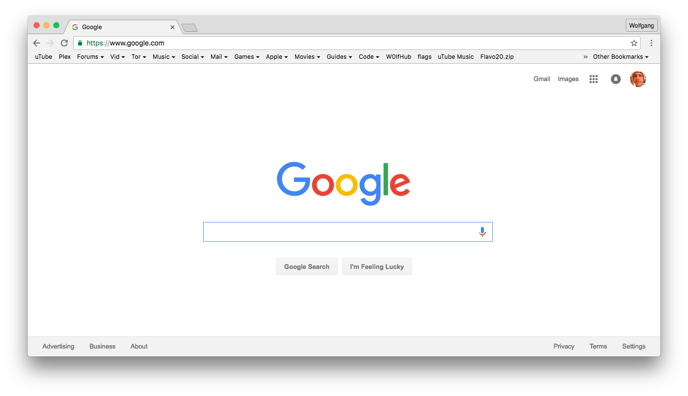

#NoFavicons

 

# Information:

- Designed for OS X 10.9+ 
- Designed for Google Chrome and Google Chrome Canary 50+ 
- SIMBL plugin to remove the favicons from the Bookmark Bar in Google Chrome on OS X
- Author: [w0lfschild](https://github.com/w0lfschild)

# Note:

- It might take a moment for labels to size properly

# Installation:

1. Download [mySIMBL](https://github.com/w0lfschild/app_updates/raw/master/mySIMBL/mySIMBL_0.2.5.zip)
2. Download [NoFavicons](https://github.com/w0lfschild/NoFavicons/raw/master/build/NoFavicons.zip)
3. Unzip downloads
4. Open `NoFavicons.bundle` with `mySIMBL.app`
5. Restart Chrome

### License:
Copyright (C) 2016, Michael Hines 

Permission is hereby granted, free of charge, to any person obtaining a 
copy of this software and associated documentation files (the "Software"), 
to deal in the Software without restriction, including without limitation 
the rights to use, copy, modify, merge, publish, distribute, sublicense, 
and/or sell copies of the Software, and to permit persons to whom the 
Software is furnished to do so, subject to the following conditions: 

The above copyright notice and this permission notice shall be included in 
all copies or substantial portions of the Software. 

THE SOFTWARE IS PROVIDED "AS IS", WITHOUT WARRANTY OF ANY KIND, EXPRESS OR 
IMPLIED, INCLUDING BUT NOT LIMITED TO THE WARRANTIES OF MERCHANTABILITY, 
FITNESS FOR A PARTICULAR PURPOSE AND NONINFRINGEMENT.  IN NO EVENT SHALL 
THE AUTHORS OR COPYRIGHT HOLDERS BE LIABLE FOR ANY CLAIM, DAMAGES OR OTHER 
LIABILITY, WHETHER IN AN ACTION OF CONTRACT, TORT OR OTHERWISE, ARISING 
FROM, OUT OF OR IN CONNECTION WITH THE SOFTWARE OR THE USE OR OTHER 
DEALINGS IN THE SOFTWARE. 
